# CoConstructCPSXBlock
This helper item allows the [CPSXBlock](https://github.com/collabassess/CPSXblock) to create environments that allow "co-constructed items." For example, suppose Alice and Bob are working on a problem set together. One particular question has two parts, and these parts are different for Alice and Bob:

<table>
    <tr>
        <td></td>
        <td>Alice</td>
        <td>Bob</td>
    </tr>
    <tr>
        <td>Part 1</td>
        <td>Find ...</td>
        <td>Suppose that... find...</td>
    </tr>
    <tr>
        <td>Part 2</td>
        <td colspan="2">Using what you previously found, compute...</td>
    </tr>
</table>

This XBlock allows the edX content creator to create interconnected questions in their collaborative sessions.

The structure used to implement this pattern is a little different. In order to determine the cohort of the user (without doing extra database queries), the "Part 2" question is duplicated, one visible only to Alice and the other only visible to Bob:

<table>
    <tr>
        <td></td>
        <td>Alice</td>
        <td>Bob</td>
    </tr>
    <tr>
        <td>Part 1</td>
        <td>Find ...</td>
        <td>Suppose that... find...</td>
    </tr>
    <tr>
        <td>Part 2</td>
        <td>Using what you previously found, compute...</td>
        <td>Using what you previously found, compute...</td>
    </tr>
</table>

This XBlock's nomenclature calls "Part 1" the `provider` questions (`provider_A` and `provider_B` for Alice and Bob, respectively) and "Part 2" the `receiver` questions (similar naming as the `providers`).

# Installation
The CoConstructCPSXBlock depends on the [CPSXBlock](https://github.com/collabasess/CPSXblock) which creates the collaborative environments. See the CPSXBlock repository for installation instructions on a new openedx instance. That installation process will include downloading and configuring the [CPSX API](https://github.com/collabassess/cpsx-api) which interfaces between the browser and the openedx MySQL database.

Once all of those are installed, perform these actions:
1. `$ git clone` this repository
2. `$ cd` into the newly downloaded repo
3. `$ npm i` to download the necessary NodeJS requirements
4. `$ ./install.sh` to build and install the project into openedx

Upgrading the XBlock is as simple as running `./upgrade.sh` in the repository directory. This script does nothing more than `git pull`ing this repo and then running `./install.sh`.

# Authoring an Item Using Co-Construction
To enable the CoConstructCPSXBlock for your course, you will need to modify the course's global settings. In the CMS, go to your course and then `Settings > Advanced Settings` from the dropdown.

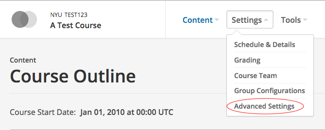

On this page, locate the "Advanced Module List" and ensure that it contains `cpsxblock` and `constructcpxblock` in the array:

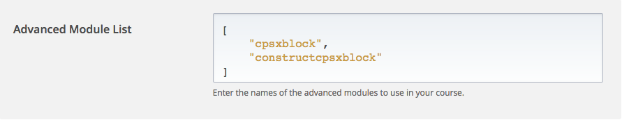

The CPSXBlock design for items is slightly different than most edX-style problems, due to the necessity of keeping partners clear on which problem they are viewing and some types of collaborative problem design patterns. While edX customarily has multiple, unrelated problems in a unit, the CPSX suite elects to use **_1 problem per unit_**. Each section contains a collection of problem sets; each subsection contains one problem set; and each unit contains either 1 problem or a short (1 to 2) series of related problems.

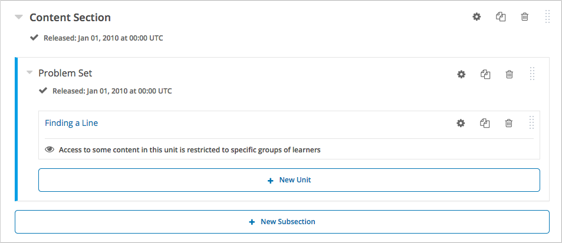

Following the current behavior of the CPSXBlock, your course must have **three** cohorts: a default (automatic) cohort, a (manual) cohort for Partner A, and a (manual) cohort for Partner B. You can modify these settings in the LMS. **Be sure to attach content groups to the partners' cohorts!** [Consult edX's documentation for more information about cohorts](https://edx.readthedocs.io/projects/edx-partner-course-staff/en/latest/course_features/cohorts/cohorts_overview.html). Once everything is configured, your settings should look like the following:

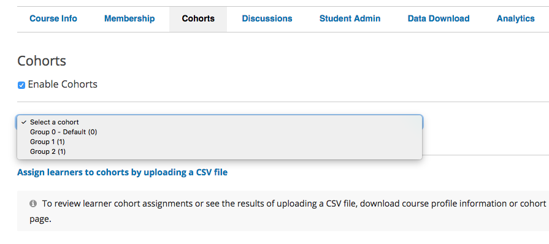
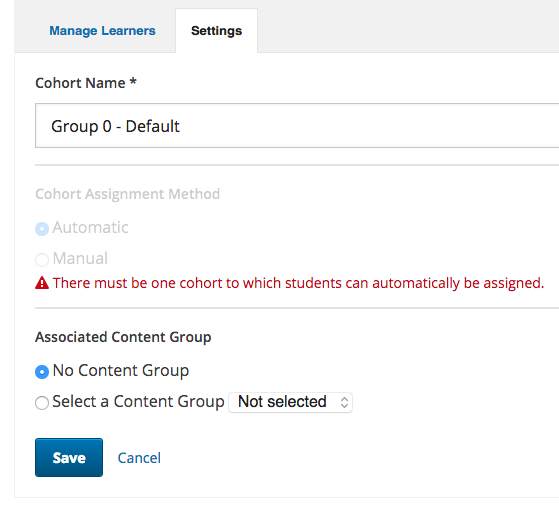
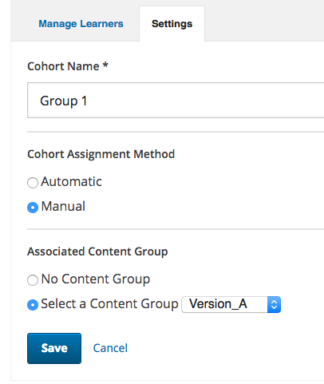
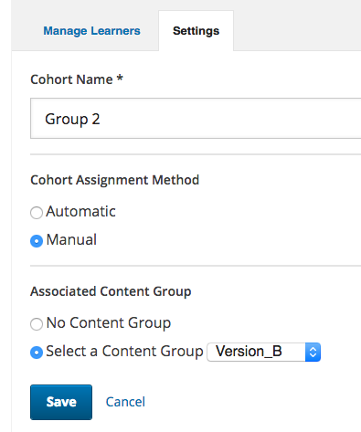

The ordering of the groups (default first, partnered after) is _currently_ necessary due to the API, but that _should_ be fixed soon.

Now that your course is properly configured, it's time to make a co-constructed item! Generally, these have four components per unit: two for the `provider` blocks and two for the `receiver` blocks. The `providers` can be any type of component (numerical, formula, text, etc.) but they **must** be configured such that Group/Cohort 1 sees `provider_A` and Group/Cohort 2 sees `provider_B` using the Access Settings tool:
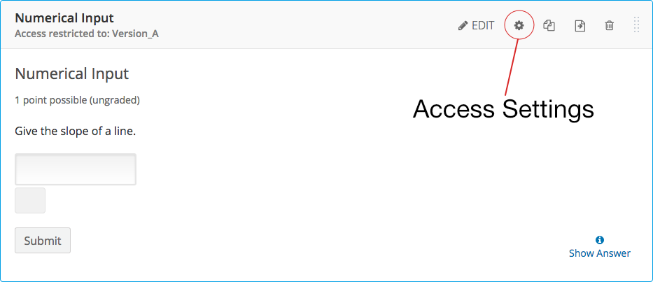
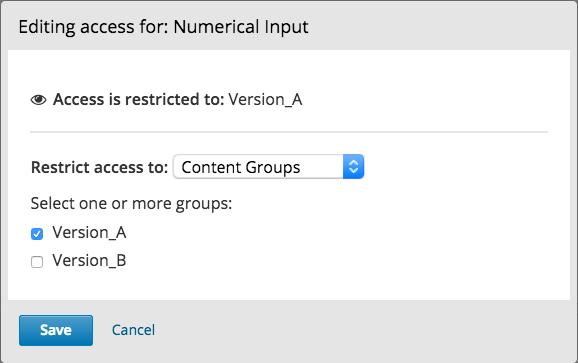
The `receivers`, as discussed in the [project overview](#CoConstructCPSXBlock), are Custom Response components that have exactly the same content. An example grading script follows:
```python
import json

def check(expect, answer):
    ans_dict = {}

    try:
        ans_dict = json.loads(answer)
    
        if not isinstance(ans_dict, dict) or "provider_A" not in ans_dict:
            # Not properly formatted or partner hasn't submitted
            raise Exception("Processing answer...")

        ###
        # LOGIC HERE
        ###
        m = float(ans_dict["provider_A"])
        b = float(ans_dict["provider_B"])
        y = float(ans_dict["answer"])

        return y == m*5. + b
    except (ValueError, TypeError) as err:
        # Not passed from server yet
        raise err
```
The `Exception` stops the grader from processing the student's answer without the context from the `providers`. While the instructor may see a stack trace in these blocks, the students will just see a yellow "Processing answer..." under the "Submit" button.

Finally, we must add the CPSXBlock and CoConstructCPSXBlock to our unit. Under "Advanced" in "Add New Component," you should find both "CPSXBlock" and "CoConstructCPSXBlock." If you don't see both, check the [Installation](#Installation) section to verify your installation. On its own, the CPSXBlock will probably not need any configuration; check its documentation about each of its configuration settings. The CoConstructCPSXBlock, on the other hand, needs some configuration. Open up the "Edit" window for the newly created CoConstructCPSXBlock. You will be greeted with a dialog box with the following settings:

* **api_host**: The host where the CPSX API is located, most likely `localhost` if it's installed on the same machine as openedx.
* **api_port**: The port on which the CPSX API is listening, most likely `3000` unless the API is running in development mode.
* **provider_userA**: The module ID for `provider_A`
* **provider_userB**: The module ID for `provider_B`
* **receiver_userA**: The module ID for `receiver_A`
* **receiver_userB**: The module ID for `receiver_B`

Finding the module IDs is simple: in the "Edit" pane of each `provider` and `receiver`, go to the "Settings" tab and scroll down until you see "Component Location ID." The string of text with "block-v1:..." is what you need:
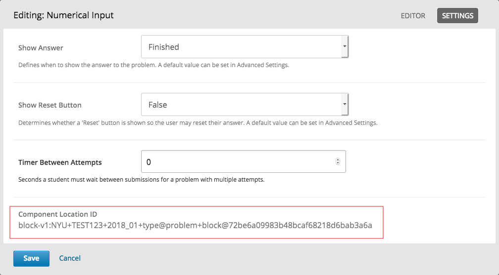
Paste that string into each respective `provider` and `receiver` module ID setting in the CoConstructCPSXBlock settings, which should look like so:
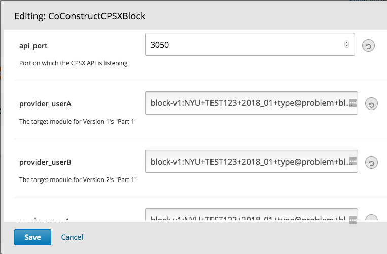

Your item should now be properly configured!

# Building
There are a couple steps to building this project. The first is rendering the XBlock's front-end code, and the second is building/running the test environment. The first task is to `git clone` this repository.

## Building the front-end interface
The `CoConstructCPSXBlock` _has the potential to use_ (but does not currently use) [React](https://reactjs.org) to render the status indicators and maintain the XBlock's state. As XBlocks [are not yet but will be](https://openedx.atlassian.net/wiki/spaces/FEDX/pages/122454990/React+evaluation+plan) written in React, this block uses [Webpack](https://webpack.js.org) to bundle the app into the `function BlockName(runtime, element) { ... }` pattern that `edx-platform` currently expects.

To build the app,
1. `$ npm i` to install all the requirements
2. `$ npm run build` to build the front-end for the first time
3. If you are working on the interface for some time, I recommend running the `webpack` watcher: `$ npm run watch`

## Running the XBlock
You will need [Docker](https://www.docker.com/get-docker). If you are using a Linux distro, [read here](https://docs.docker.com/compose/install/#install-compose) to learn how to properly install Docker Compose.

After Docker's installation, perform these tasks:
    
 1. `$ cd cpsxblock-coconstruction`
 2. `$ docker-compose build sdk && docker-compose build app` to create the SDK environment image and XBlock app
 3. `$ docker-compose up` starts the XBlock SDK server. 
 
 The XBlock will be live at `localhost:5000`.
 
 # Future Development
Currently, once a student submits their answer for a `receiver` question, the page will reload and the student will see a JSON dictionary in that field. This behavior should be changed as it reveals a bit of the internals of the XBlock, and it would probably confuse the student. I'd recommened having another AJAX query to the API that replaces the student's original submission for the `receiver` in the database _before_ having the student's page reload. This way the grader will grade the correct payload and the student will only see her answer — not some strange JSON object.